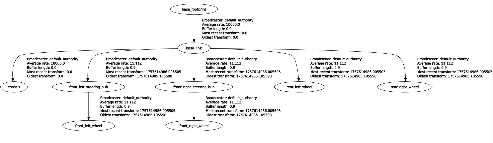

# erp42_description
ERP42 Gazebo simulation package. Uses ERP42 platform-related properties and control plugins to define ERP42 in Gazebo.
``` bash
$ ros2 launch erp42_dscription vehicle_description.launch.py
```

<div align="center">

  
  <br/>
  <figcaption>ERP42 description in .xacro</figcaption>

</div>

<br/>

<div align="center">

  
  <br/>
  <figcaption>Transforms being broadcast</figcaption>

</div>

<br/>

All settings are macroized in the **.xacro** file, so you can use them as follows:
``` xml
<!-- Include files -->
<xacro:include filename="$(find erp42_description)/urdf/erp42_model.xacro"/>

<!-- ERP42 model description -->
<xacro:erp42_model/>
```