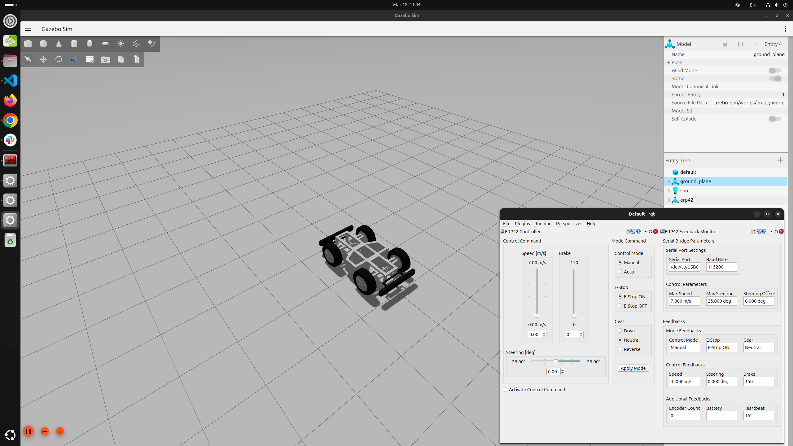

# erp42_gazebo_sim
ERP42 Gazebo simulation package. Uses ERP42 platform-related properties and control plugins to define ERP42 in Gazebo.
``` bash
$ ros2 launch erp42_gazebo_sim gazebo_sim.launch.py
```

<div align="center">

  
  <br/>
  <figcaption>ERP42 Gazebo-Sim simulation</figcaption>

</div>

<br/><br/>

## liberp42_control.so
If you use the **erp42_description.xacro** macro, you can use pre-set values, and they can be used as follows.
``` xml
<!-- Include files -->
<xacro:include filename="$(find erp42_gazebo_sim)/urdf/erp42_description.xacro"/>

<!-- ERP42 model description and gazebo control settings -->
<xacro:erp42_description 
    base_link = "erp42"
    publish_odometry = "true"
/>
```

</br>

**liberp42_control.so** is a plugin that enables the simulation of the ERP42 platform using the same interface as **serial_bridge**.
```xml
<gazebo>
    
    ...

    <plugin name="gz::sim::systems::ERP42Control" filename="liberp42_control.so">

        <left_steer_joint>  : Left steer joint name
        <right_steer_joint> : Right steer joint name
        <front_left_joint>  : Front left wheel joint name
        <front_right_joint> : Front right wheel joint name
        <rear_left_joint>   : Rear left wheel joint name
        <rear_right_joint>  : Rear right wheel joint name

        <wheel_base>         : Wheelbase length in meter
        <kingpin_width>      : Kingpin width in meter
        <front_wheel_tread>  : Front wheel tread in meter
        <rear_wheel_tread>   : Rear wheel tread in meter
        <front_wheel_radius> : Front wheel radius in meter
        <rear_wheel_radius>  : Rear wheel radius in meter

        <steer_limit>        : Max steer angle
        <steer_p_gain>       : Steer angle P gain
        <velocity_limit>     : Max velocity in m/s
        <acceleration_limit> : Max acceleration in m/s^2, It affects convergence to the target speed.
        <brake_deceleration> : Brake deceleration in m/s^2, It is used when executing a break command.

        <publish_odometry>   : Odometry flag, odometry topic and odometry transform
        <odometry_frequency> : Odometry transform, publication rate
        <odometry_topic>     : Odometry topic name
        <odometry_frame>     : Odometry frame ID
        <child_frame>        : Child frame ID of odometry topic and transform

    </plugin>

    ...

</gazebo>
```

<br/><br/>

## erp42_gazebo_control
This function allows you to control ERP42 in the Gazebo simulation via **erp42_msgs/msg/ControlCommand** and **erp42_msgs/srv/ModeCommand**.  
It also publishes **erp42_msgs/msg/Feedback**.

### Topic / Service Names
| Interface | Entitiy      | Type                              | Name                       | Description                                      |
| --------- | ------------ | --------------------------------- |--------------------------- | ------------------------------------------------ |
| Topic     | Subscription | **erp42_msgs/msg/ControlCommand** | **/erp42/control_command** | Control command includes speed, steering, brake  |
| Topic     | Publisher    | **erp42_msgs/msg/Feedback**       | **/erp42/feedback**        | Feedback from ERP42                              |
| Servie    | Server       | **erp42_msgs/srv/ModeCommand**    | **/erp42/mode_command**    | Mode command includes control mode, E-stop, gear |

### QoS
The ModeCommand.srv service QoS profile is the system default.
| QoS Policy  | QoS Policy Key |
| ----------- | -------------- |
| History     | **Keep Last**  |
| Depth       | **1**          |
| Reliability | **Reliable**   |
| Durability  | **Volatile**   |

### Parameters
You can set the parameters below, but they are already included in the **liberp42_control.so** plugin.  
Also, things like **steering_offset_deg** are not very useful because this is a simulation.
| Parameter Name          | Unit | Description                                                                                           |
| ----------------------- | ---- | ----------------------------------------------------------------------------------------------------- |
| **max_speed_mps**       | m/s  | The vehicle's maximum linear speed. When using Auto mode, the PCU limits it to 25 km/h.               |
| **max_steering_deg**    | deg  | The vehicle's maximum steering angle. Due to hardware limitations, 25 degrees or less is recommended. |
| **steering_offset_deg** | deg  | Provides an offset to the steering angle. Left is positive (+), right is negative (-).                |
