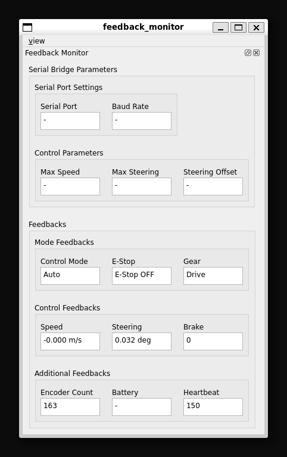
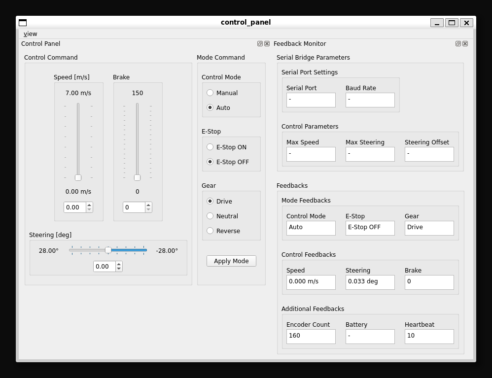
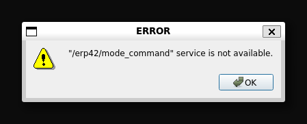

# erp42_gui
A GUI package that allows you to check feedback information from the ERP42 platform and issue control commands and mode commands for debugging.  

<br/>

## Feedback Monitor
Reads the parameters of **erp42_serial_bridge** and displays the feedback data currently being issued from the vehicle.  
Feedback from the vehicle can be read from both **erp42_serial_bridge** and **erp42_gazebo_bridge**. However, parameters from **erp42_gazebo_bridge** are not read.
```bash
$ ros2 run erp42_gui feedback_monitor
```

<div align="center">

  
  <figcaption>feedback_monitor</figcaption>

</div>

<br/><br/>

## Control Panel
This is a GUI for changing vehicle modes and issuing control inputs. **feedback_monitor** runs by default, so you don't need to run **control_panel** if you run **feedback_monitor**.
If the **Activate Control Panel** checkbox is not checked, no mode input or control input will be published or requested.
```bash
$ ros2 run erp42_gui control_panel
```

<div align="center">
  
  <figcaption>control_panel</figcaption>

  <br/>

  
  <figcaption>
    This message appears when you click the Apply button if the service server handling **mode_command** is unavailable.
    </br>
    Either **erp42_serial_bridge** or **erp42_gazebo_bridge** must be running.
  </figcaption>

</div>