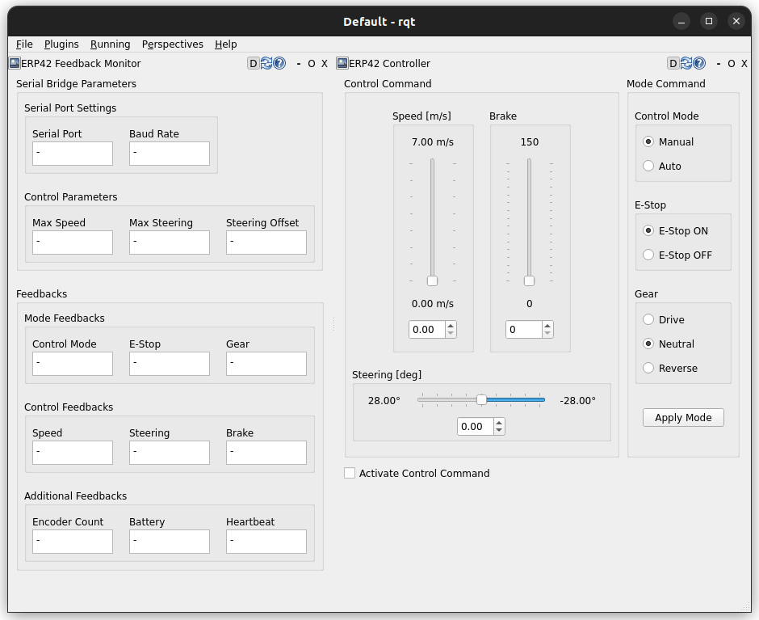
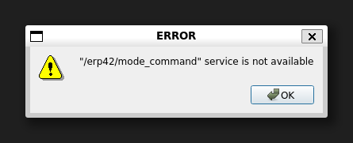

# erp42_rqt_plugin
A GUI package that allows you to check feedback information from the ERP42 platform and issue control commands and mode commands for debugging.  

 

  

  

## Control Panel
This is a GUI for changing vehicle modes and issuing control inputs. **feedback_monitor** runs by default, so you don't need to run **control_panel** if you run **feedback_monitor**.
If the **Activate Control Panel** checkbox is not checked, no mode input or control input will be published or requested.

 

  
   
  <figcaption>
    This message appears when you click the Apply button if the service server handling **mode_command** is unavailable.
     
    Either erp42_serial_bridge or erp42_gazebo_bridge must be running.
  </figcaption>

  

## Feedback Monitor
Reads the parameters of **erp42_serial_bridge** or **erp42_gazebo_control** and displays the feedback data currently being issued from the vehicle.

If the **erp42_serial_bridge** or **erp42_gazebo_control** node is not running, the following terminal log is displayed.

**[ERP42 Warning]: Failed to read vehicle parameters. Plugin expects 'serial_bridge' or 'erp42_gazebo_control' node. at line 279 in /home/mingq/workspace/ros2/erp42_ros/src/erp42_rqt_plugin/src/feedback_monitor_plugin.cpp**
